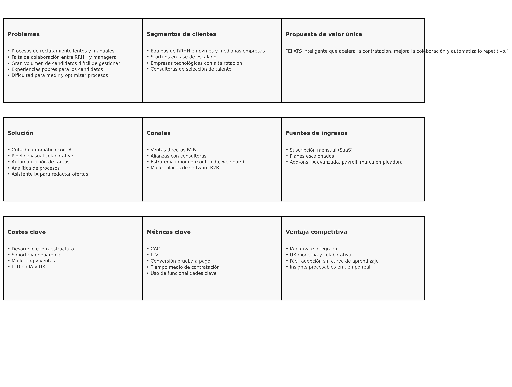
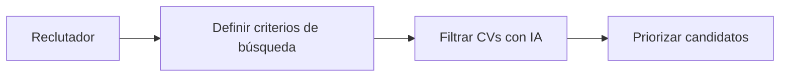
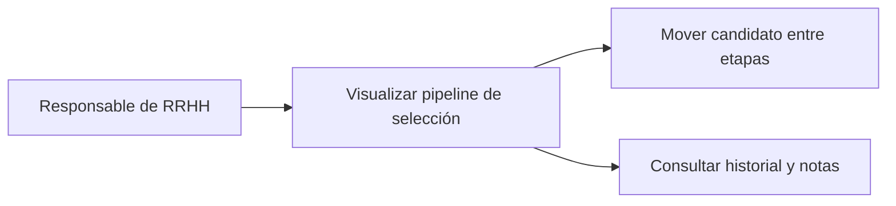
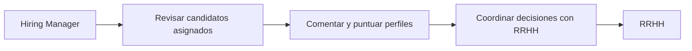
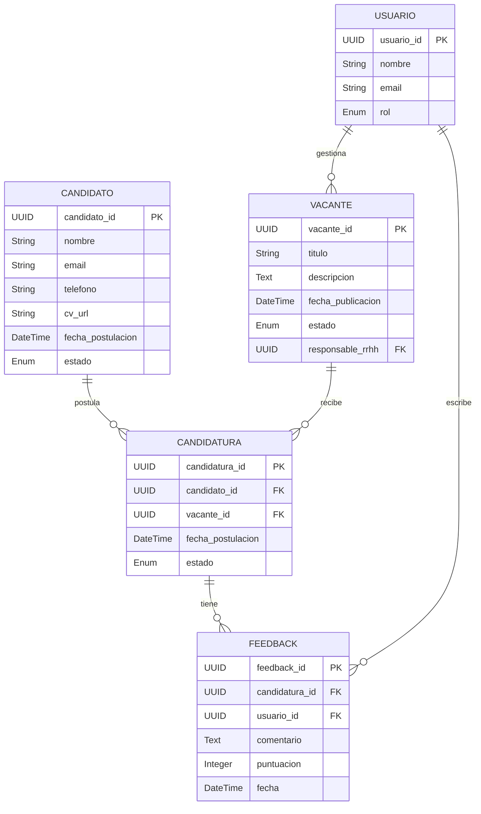
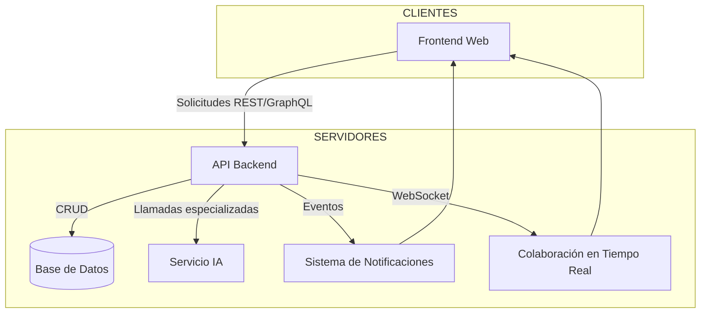
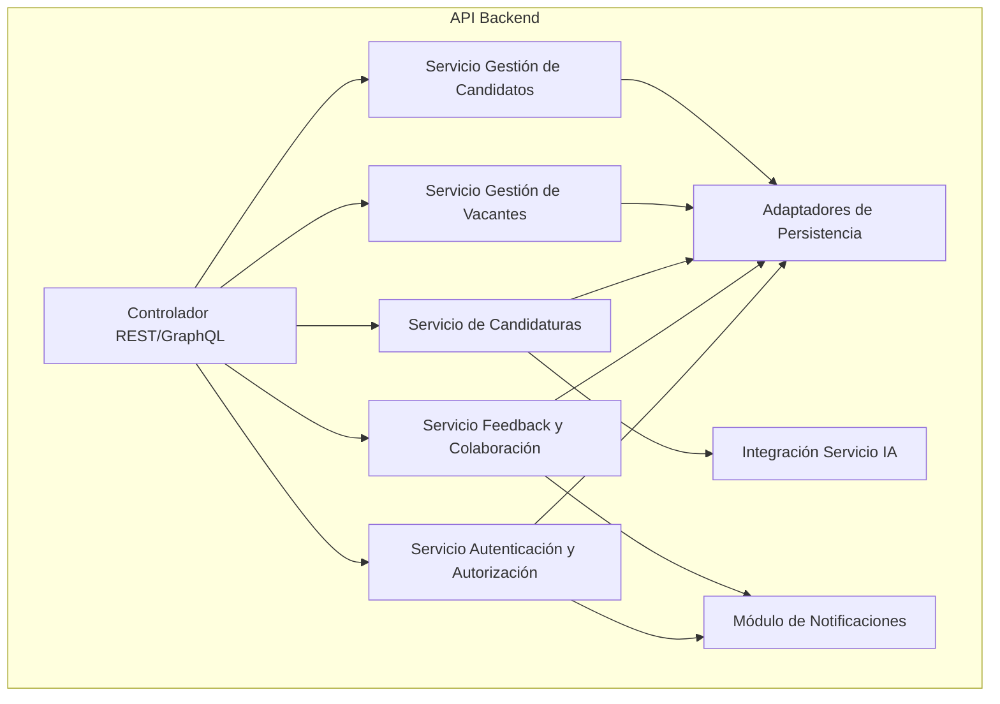

## Descripción breve del software LTI, valor añadido y ventajas competitivas.

Aquí tienes una propuesta de descripción basada en el modelo de propuesta de valor de Osterwalder (Propuesta de Valor = Jobs to be Done + Pains aliviados + Gains generados):

**Descripción del Software de LTI**

LTI es un sistema ATS (Applicant Tracking System) de nueva generación diseñado para transformar la manera en que los equipos de talento identifican, seleccionan y contratan a los mejores candidatos. Nuestra plataforma potencia la eficiencia de los departamentos de Recursos Humanos al centralizar y automatizar el ciclo completo de reclutamiento, desde la publicación de ofertas hasta la contratación final.

**Valor añadido y ventajas competitivas**

🧠 Asistencia de IA: Automatiza tareas repetitivas como cribado de CVs, generación de descripciones de puesto y respuestas a candidatos, liberando tiempo para tareas estratégicas.

🤝 Colaboración en tiempo real: Permite a reclutadores y hiring managers trabajar sincronizados, con evaluaciones compartidas, comentarios y decisiones centralizadas en una sola plataforma.

⚙️ Automatización inteligente: Desde el envío de correos personalizados hasta el agendamiento de entrevistas y recordatorios, LTI reduce significativamente los tiempos de contratación.

📊 Análisis predictivo: Herramientas de analítica e informes en tiempo real que permiten optimizar continuamente los procesos de selección y mejorar la calidad de la contratación.

🌐 Integración fluida: Conectividad sencilla con las principales bolsas de empleo, calendarios y herramientas de comunicación como Slack, Outlook y Zoom.

**¿Qué hace única a LTI?**

Mientras otros ATS se centran en administrar procesos, LTI crea ventajas competitivas: combinamos automatización avanzada con una experiencia de usuario centrada en la colaboración, impulsada por IA. Esto permite a nuestros clientes contratar más rápido, con mayor precisión y alineación entre los equipos.

## Explicación de las funciones principales.

#### Funcionalidades básicas del ATS de LTI (ordenadas por prioridad)

**1. Automatización del filtrado y priorización de candidatos con IA**

- Cribado inteligente de CVs según criterios del puesto
- Rankeo automático de perfiles según ajuste cultural y técnico
- Eliminación de sesgos mediante evaluación objetiva

**2. Gestión integral del pipeline de selección**

- Visualización tipo kanban del estado de cada candidato
- Movimientos drag & drop entre etapas del proceso
- Historial completo de interacciones

**3. Colaboración en tiempo real entre reclutadores y hiring managers**

- Comentarios compartidos por candidato
- Notificaciones y tareas asignables
- Herramienta de evaluación estructurada y comparativa

**4. Automatización de tareas administrativas**

- Envío automático de emails (confirmaciones, rechazos, seguimientos)
- Programación de entrevistas con integración de calendarios
- Plantillas personalizables

**5. Generación asistida de descripciones de puestos y publicaciones**

- Asistente IA para redactar y optimizar anuncios
- Recomendaciones SEO para atraer más candidatos
- Publicación multicanal (portales de empleo, redes, webs corporativas)

**6. Analítica y reportes en tiempo real**

- KPIs de tiempo de contratación, conversión por etapa, calidad del sourcing
- Informes por equipo, reclutador, departamento o campaña
- Detección de cuellos de botella

**7. Portal de candidatos y experiencia de usuario fluida**

- Aplicación rápida (1 clic, LinkedIn, CV parseado)
- Seguimiento del estado de su candidatura
- Comunicación directa desde la plataforma

**8. Base de datos de talento reutilizable (Talent Pool)**

- Archivado de perfiles prometedores no seleccionados
- Alertas para candidatos que encajan en nuevas vacantes
- Segmentación avanzada por habilidades, experiencia o geografía

**9. Integraciones externas**

- Con bolsas de empleo (LinkedIn, Indeed, InfoJobs, etc.)
- Calendarios (Google, Outlook) y herramientas de videollamadas
- Sistemas de RRHH y nóminas (HRIS)

## Añadir un diagrama Lean Canvas para entender el modelo de negocio.

**Lean Canvas – LTI ATS**

| Bloque                       | Contenido                                                                                                                                                                                                                                        |
| ---------------------------- | ------------------------------------------------------------------------------------------------------------------------------------------------------------------------------------------------------------------------------------------------ |
| **Problemas**                | • Procesos de reclutamiento lentos y manuales<br>• Falta de colaboración entre RRHH y managers<br>• Gran volumen de candidatos difícil de gestionar<br>• Experiencias pobres para los candidatos<br>• Dificultad para medir y optimizar procesos |
| **Segmentos de clientes**    | • Equipos de RRHH en pymes y medianas empresas<br>• Startups en fase de escalado<br>• Empresas tecnológicas con alta rotación<br>• Consultoras de selección de talento                                                                           |
| **Propuesta de valor única** | “El ATS inteligente que acelera la contratación, mejora la colaboración y automatiza lo repetitivo.”                                                                                                                                             |
| **Solución**                 | • Cribado automático con IA<br>• Pipeline visual colaborativo<br>• Automatización de tareas<br>• Analítica de procesos<br>• Asistente IA para redactar ofertas                                                                                   |
| **Canales**                  | • Ventas directas B2B<br>• Alianzas con consultoras<br>• Estrategia inbound (contenido, webinars)<br>• Marketplaces de software B2B                                                                                                              |
| **Fuentes de ingresos**      | • Suscripción mensual (SaaS)<br>• Planes escalonados<br>• Add-ons: IA avanzada, payroll, marca empleadora                                                                                                                                        |
| **Costes clave**             | • Desarrollo e infraestructura<br>• Soporte y onboarding<br>• Marketing y ventas<br>• I+D en IA y UX                                                                                                                                             |
| **Métricas clave**           | • CAC<br>• LTV<br>• Conversión prueba a pago<br>• Tiempo medio de contratación<br>• Uso de funcionalidades clave                                                                                                                                 |
| **Ventaja competitiva**      | • IA nativa e integrada<br>• UX moderna y colaborativa<br>• Fácil adopción sin curva de aprendizaje<br>• Insights procesables en tiempo real                                                                                                     |

En formato imagen:


## Descripción de los 3 casos de uso principales, con el diagrama asociado a cada uno.

### 📘 Casos de Uso Principales – ATS LTI

#### 🎯 1. Filtrado y Priorización Automática de Candidatos

**Descripción:**
El sistema permite a los reclutadores definir criterios de búsqueda, y una IA integrada analiza automáticamente los CVs recibidos para priorizar aquellos que más se ajustan a la vacante.

**Actores:**

- Reclutador
- Sistema de IA

**Objetivo:**
Reducir el tiempo de cribado y mejorar la calidad del shortlist de candidatos.

**🖼️ Diagrama UML – Caso de Uso**

```
@startuml
actor "Reclutador" as R
rectangle "ATS LTI" {
  usecase "Definir criterios de búsqueda" as UC1
  usecase "Filtrar CVs con IA" as UC2
  usecase "Priorizar candidatos" as UC3
}
R --> UC1
UC1 --> UC2
UC2 --> UC3
@enduml
```

**🖼️ Mermaid**



#### 🧩 2. Gestión Visual del Proceso de Selección

**Descripción:**
Permite a los usuarios mover candidatos entre etapas, ver su historial completo y colaborar mediante notas internas.

**Actores:**

- Responsable de RRHH
- Plataforma ATS

**Objetivo:**
Aumentar la visibilidad, trazabilidad y organización del proceso de contratación.

**🖼️ Diagrama UML – Caso de Uso**

```
@startuml
actor "Responsable de RRHH" as HR
rectangle "ATS LTI" {
  usecase "Visualizar pipeline de selección" as UC1
  usecase "Mover candidato entre etapas" as UC2
  usecase "Consultar historial y notas" as UC3
}
HR --> UC1
UC1 --> UC2
UC1 --> UC3
@enduml
```

**🖼️ Mermaid**



#### 🤝 3. Colaboración con Hiring Managers

**Descripción:**
Los hiring managers acceden al sistema para revisar perfiles, evaluar candidatos y compartir feedback estructurado con el equipo de RRHH.

**Actores:**

- Hiring Manager
- RRHH (actor secundario)

**Objetivo:**
Facilitar decisiones colaborativas basadas en datos y opiniones compartidas.

**🖼️ Diagrama UML – Caso de Uso**

```
@startuml
actor "Hiring Manager" as HM
actor "RRHH" as HR
rectangle "ATS LTI" {
  usecase "Revisar candidatos asignados" as UC1
  usecase "Comentar y puntuar perfiles" as UC2
  usecase "Coordinar decisiones con RRHH" as UC3
}
HM --> UC1
UC1 --> UC2
UC2 --> UC3
UC3 --> HR
@enduml
```

**🖼️ Mermaid**



## Modelo de datos que cubra entidades, atributos (nombre y tipo) y relaciones.

# Modelo de Datos ATS LTI

## Entidades y Atributos

### 1. Candidato

| Atributo            | Tipo         | Descripción                  |
| ------------------- | ------------ | ---------------------------- |
| `candidato_id`      | UUID         | Identificador único          |
| `nombre`            | String       | Nombre completo              |
| `email`             | String       | Correo electrónico           |
| `telefono`          | String       | Número de teléfono           |
| `cv_url`            | String (URL) | Enlace al CV                 |
| `fecha_postulacion` | DateTime     | Fecha en que aplicó          |
| `estado`            | Enum         | Estado actual en el pipeline |

### 2. Vacante

| Atributo            | Tipo      | Descripción                |
| ------------------- | --------- | -------------------------- |
| `vacante_id`        | UUID      | Identificador único        |
| `titulo`            | String    | Nombre del puesto          |
| `descripcion`       | Text      | Descripción detallada      |
| `fecha_publicacion` | DateTime  | Fecha de publicación       |
| `estado`            | Enum      | Abierta, cerrada, en pausa |
| `responsable_rrhh`  | UUID (FK) | Referencia al usuario RRHH |

### 3. Usuario

| Atributo     | Tipo   | Descripción                       |
| ------------ | ------ | --------------------------------- |
| `usuario_id` | UUID   | Identificador único               |
| `nombre`     | String | Nombre del usuario                |
| `email`      | String | Correo electrónico                |
| `rol`        | Enum   | Reclutador, Hiring Manager, Admin |

### 4. Candidatura

| Atributo            | Tipo      | Descripción                |
| ------------------- | --------- | -------------------------- |
| `candidatura_id`    | UUID      | Identificador único        |
| `candidato_id`      | UUID (FK) | Referencia a Candidato     |
| `vacante_id`        | UUID (FK) | Referencia a Vacante       |
| `fecha_postulacion` | DateTime  | Fecha de postulación       |
| `estado`            | Enum      | Etapa actual en el proceso |

### 5. Feedback

| Atributo         | Tipo          | Descripción              |
| ---------------- | ------------- | ------------------------ |
| `feedback_id`    | UUID          | Identificador único      |
| `candidatura_id` | UUID (FK)     | Referencia a Candidatura |
| `usuario_id`     | UUID (FK)     | Autor del feedback       |
| `comentario`     | Text          | Comentario o evaluación  |
| `puntuacion`     | Integer (1-5) | Puntuación del candidato |
| `fecha`          | DateTime      | Fecha del feedback       |

## Relaciones

| Entidad Origen | Relación | Entidad Destino | Tipo         | Descripción                                     |
| -------------- | -------- | --------------- | ------------ | ----------------------------------------------- |
| Usuario        | 1 --- n  | Vacante         | Uno a muchos | Un usuario RRHH puede gestionar muchas vacantes |
| Candidato      | 1 --- n  | Candidatura     | Uno a muchos | Un candidato puede postular a muchas vacantes   |
| Vacante        | 1 --- n  | Candidatura     | Uno a muchos | Una vacante puede tener muchas candidaturas     |
| Candidatura    | 1 --- n  | Feedback        | Uno a muchos | Una candidatura puede tener múltiples feedbacks |
| Usuario        | 1 --- n  | Feedback        | Uno a muchos | Un usuario puede dar muchos feedbacks           |

Este modelo cubre la gestión básica de candidatos, vacantes, usuarios, procesos de candidatura y feedback colaborativo, ideal para un sistema ATS moderno.

¿Quieres que te lo amplíe con más detalle o con diagrama ER?



## Diseño del sistema a alto nivel, tanto explicado como diagrama adjunto.

### Diseño de Sistema ATS LTI - Alto Nivel

#### 1. Descripción General

El sistema ATS LTI es una plataforma web SaaS que facilita la gestión integral del proceso de selección de personal, integrando IA para optimizar el filtrado y priorización de candidatos, además de promover colaboración en tiempo real entre reclutadores y managers.

#### 2. Componentes Principales

| Componente                      | Función Principal                                                        |
| ------------------------------- | ------------------------------------------------------------------------ |
| **Frontend Web**                | Interfaz de usuario para reclutadores, hiring managers y admins.         |
| **API Backend**                 | Lógica de negocio, manejo de datos, autenticación y autorización.        |
| **Base de Datos**               | Almacenamiento persistente de candidatos, vacantes, usuarios y feedback. |
| **Servicio IA**                 | Módulo especializado en análisis y priorización automática de CVs.       |
| **Sistema de Notificaciones**   | Gestión de alertas, emails y notificaciones en tiempo real.              |
| **Colaboración en Tiempo Real** | WebSocket / Pub-Sub para comentarios y actualizaciones instantáneas.     |

#### 3. Flujo Simplificado

1. Usuario (Reclutador o Manager) interactúa con el **Frontend**.
2. El **Frontend** consume la **API Backend** para operaciones CRUD y lógica.
3. Para filtrado avanzado, la API consulta al **Servicio IA**.
4. Los datos se almacenan y consultan en la **Base de Datos**.
5. Eventos de colaboración y cambios se sincronizan en tiempo real vía **WebSocket**.
6. Las notificaciones se gestionan y envían mediante el **Sistema de Notificaciones**.

#### 4. Diagrama de Arquitectura (Mermaid)



## Diagrama C4 que llegue en profundidad a uno de los componentes del sistema, el que prefieras.

Perfecto, voy a darte el diagrama C4 - Nivel 3 (Componentes) para el componente API Backend, que es clave en el sistema ATS LTI.

Te lo entrego con la explicación y el diagrama en formato Mermaid.

### Diagrama C4 Nivel 3: Componentes del API Backend

#### 1. Contexto rápido

El **API Backend** es el núcleo donde reside la lógica de negocio del ATS LTI. Atiende peticiones del frontend, procesa datos, se comunica con otros servicios (base de datos, IA, notificaciones) y gestiona la seguridad.

#### 2. Componentes Principales del API Backend

| Componente                                   | Descripción                                                                       |
| -------------------------------------------- | --------------------------------------------------------------------------------- |
| **Controlador REST/GraphQL**                 | Recibe y valida peticiones externas, enruta a servicios internos.                 |
| **Servicio de Autenticación y Autorización** | Maneja login, roles, permisos y tokens de acceso.                                 |
| **Servicio de Gestión de Candidatos**        | CRUD y lógica específica para datos y estados de candidatos.                      |
| **Servicio de Gestión de Vacantes**          | CRUD y gestión de vacantes y asignaciones.                                        |
| **Servicio de Candidaturas**                 | Controla la relación candidato-vacante y el proceso de selección.                 |
| **Servicio de Feedback y Colaboración**      | Administra comentarios, evaluaciones y colaboración en tiempo real.               |
| **Integración con Servicio IA**              | Consulta y recibe análisis de candidatos para filtrado y priorización.            |
| **Módulo de Notificaciones**                 | Genera y envía eventos de notificación para usuarios (email, alertas push, etc.). |
| **Adaptadores de Persistencia**              | Acceso a base de datos, manejo de transacciones y consultas optimizadas.          |

##### 3. Diagrama de Componentes (Mermaid)


